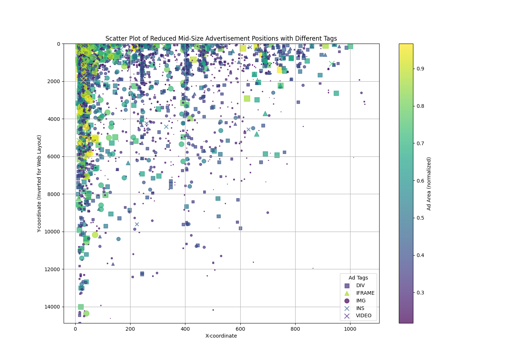
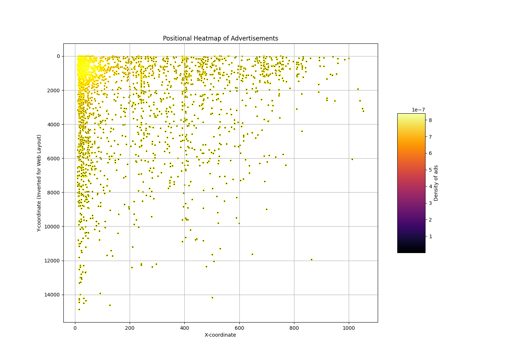

# Analysis of Advertisement Positions

This repository contains an analysis of advertisement positions on web pages. The study uses various data visualization techniques to represent advertisements' density, distribution, and characteristics.

## Visualizations

The following sections showcase the visual analyses conducted, displayed in a sequence that narrates the data exploration process from initial overview to detailed segmentation.

### Scatter Plot of Advertisement Positions

This initial scatter plot provides an overview of all advertisements' positions, including outliers, giving us a first glance at the overall distribution.

### Scatter Plot of Advertisement Positions (Outliers Removed)

This visualization refines the initial overview by removing outliers to focus on the core distribution areas of advertisements.

### Advertisement Scatter Plot Filtered Zero_based

### Advertisement Scatter Plot Web_Layout

### Advertisement Distribution Ad Area (Normalized)

### Advertisement Positions with Different Tags (Smaller point size for visibility)

###  Less Transparency for a clearer view of mid-sized Ads

### Different shapes for different tags Reduced-Size Ads

### Heat Map (Positional Density of Ads)

### Heat Map (Positional Density of Ads with Tags)

